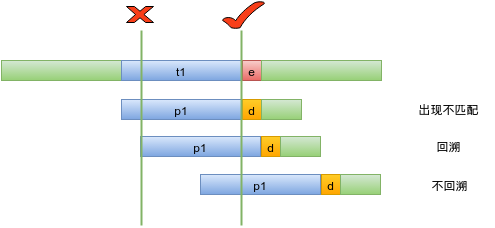
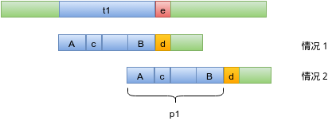

## 1、字符串匹配问题简介
&emsp;&emsp;所谓字符串匹配就是，在给定的字符文本`text`中，找出模式串`pattern`第一次出现的位置，如果`text`中不存在等于`pattern`的子串，则匹配失败。《算法导论》第23章一开始就给出了字符串匹配问题的形式定义，大家可以去参考一下。
## 2、BF算法
&emsp;&emsp;说到字符串匹配，最容易想到的方法就是暴力求解`(Brute Force)`。下面给出`BF`方法的代码（思路是参考《算法导论》的，比我们教材上写的便于理解）：
``` cpp
//暴力查找字符串t中p出现的位置
int BFSearch(char* t, char* p){
    int i = 0;//当前匹配到的t串中的位置
    int j = 0;//模式串p的匹配位置
    int tsize = strlen(t);
    int psize = strlen(p);
    while(i <= tsize-psize && j < psize){
        if(t[i+j] == p[j]){
            j++;
        }else{
            i++;
            j = 0;
        }
    }
    if(j >= psize)
        return i;
    return -1;
}

```
&emsp;&emsp;暴力求解方法的时间复杂度为`O(m*n)`，为什么呢？思路使然。我们来看代码，之所以时间复杂度是`O(m*n)`，是因为在匹配失效的情况下，匹配位置有回溯（代码中的`i++; j = 0`）。
&emsp;&emsp;为什么需要回溯呢？我们来考察下面这种情况：`p = aaac`，`t = aaaaccaaaa`，当匹配到如下位置的时候（加粗部分）：
&emsp;&emsp;&emsp;&emsp;&emsp;&emsp;aa**a**ccaaaa
&emsp;&emsp;&emsp;&emsp;&emsp;&emsp;aa**c**
&emsp;&emsp;出现了不匹配的现象，如果不回溯的话，那就紧接着上面的`t`中的加粗部分的`a`继续比较，如下：
&emsp;&emsp;&emsp;&emsp;&emsp;&emsp;aa**a**ccaaaa
&emsp;&emsp;&emsp;&emsp;&emsp;&emsp;&emsp;**a**ac
&emsp;&emsp;但是这样就错过了正确的匹配情况。实际上，暴力解法需要回溯是因为模式串`p`有重复的字符。假设`p`的字符互不相等，那么在匹配时候出现不同的时候，假定已经匹配通过的`t`的前缀为`t'`，`p`的前缀为`p'`，那么`t'`和`p'`是匹配的，并且`p'`的字符各不相同，所以不存在`t'`中的子串可以和`p'`的前缀匹配，那么就不需要回溯了，如果回溯必然不匹配，这样就可以使得时间复杂度倾向于线性了。但是，这种情况只是特例，我们需要更加普遍的、时间复杂度为线性的匹配算法。

## 3、KMP算法
### 3.1、KMP思路
&emsp;&emsp;我们来考察以下匹配的方法：
&emsp;&emsp;&emsp;&emsp;
&emsp;&emsp;对于回溯的方法，每次出现不匹配就重新回到一开始匹配的第二个字符再重新开始匹配（也就是`t`的游标回到`t1`的第二个字母，`p`的游标回到第一个字母），而我们希望不回溯，从不匹配的地方开始匹配。我们把上图的不回溯的方法具体表达一下：
&emsp;&emsp;&emsp;&emsp;&emsp;
&emsp;&emsp;当出现不匹配的时候（图中情况１），按照回溯的思想需要从头再开始匹配，但是，回溯再匹配的时候可能会出现如图情况２所示的状态，并且又匹配到了`e`（当然，这种情况也可能不会出现，但是如果`t`中`p`第一次出现的位置确实在`t1`中，那么这种情况就一定会出现，至少是在恰好回溯到这个位置的时候）。我们来考察情况１和情况２，可以看见，`p1`的前缀`A`和后缀`B`是匹配的，如果我们找到了`p1`串中匹配的最大的前缀串和后缀串，那么我们就不需要回溯了，只要`p`的游标回到`p1`前缀串的后一个字母开始匹配就好了，时间复杂度为`O(n)`，`n`为文本长度，这就是`KMP`的主要思路。

### 3.2、Next数组的递推
&emsp;&emsp;其实我觉得`KMP`里面最难的就是`next`数组的计算，实际上如果我们理解了其中的递推关系，写出代码也就容易了。
&emsp;&emsp;对于模式串`p`的位置`i`（也就是下标`i`，从`0`开始），假定`next[i] = k`(也就是说，下标`i`之前的子串的匹配的最长前缀和后缀的长度是`k`)，那么对于位置`i+1`，我们需要考察一下`p[i]`和`p[k]`（也就是考察前缀的后一个字母和后缀的后一个字母，如上图的`c`和`d`），如果`p[i] == p[k]`,那么`next[i+1] = next[i]+1`，这个是显而易见的。
&emsp;&emsp;如果`p[i] ！= p[k]`（即`c`和`d`是不匹配的），我们需要去考察之前的那个前后缀中匹配的前后缀，也就是上图`A`或`B`的前后缀，为了便于计算，我们取`A`子串，但实际上比较的是`A`的前缀和`B`的后缀。令`h = next[k]`（也就是`A`子串的匹配的最长前后缀的长度），考察方式和上面一样，如果`p[h] == p[i]`，即前缀后一个字母和后缀后一个字母相等，则`next[i+1] = h+1`，这个也是显而易见的，和上面思路一样。如果`p[h] != p[i]`，那就重复此过程，继续递推下去。
&emsp;&emsp;这就是`next`数组的递推关系，只要给个起始值`next[0]`，就可以计算下去了，时间复杂度为`O(m)`，`m`为模式串的长度。
&emsp;&emsp;**这个`next`的解法不是最优的，可以继续优化，后续再补上（主要是需要画图，暂时不想画了）。**

### 3.3、KMP算法的一种代码实现
&emsp;&emsp;为了保持和`BF`代码的一致性，我给出一种实现方式，如下：
``` cpp
//求next数组
void initNext(char* p){
    int len = strlen(p);
    next[0] = 0;
    int k = 0;
    int j = 0;
    while(j < len){
        if(k == 0 || p[j] == p[k]){
            k++;
            j++;
            next[j] = k;
        }else{
            k = next[k];
        }
    }

}

//KMP查找字符串t中p出现的位置
int KMPSearch(char* t, char* p){
    initNext(p);
    int i = 0;//当前匹配到的t串中的位置
    int j = 0;//模式串p的匹配位置
    int tsize = strlen(t);
    int psize = strlen(p);
    while(i <= tsize-psize && j < psize){
        if(t[i+j] == p[j]){
            j++;
        }else{
            i++;
            j = next[j];
        }
    }
    if(j >= psize)
        return i;
    return -1;
}
```
&emsp;&emsp;需要说明的是，很多教材给出的`next`数组的起始值是`-1`，即`next[0] = -1`，这里我给出的是`0`，《算法导论》也是给的`0`。这个问题不大，和你的匹配算法是关联的，我这样做是想保持和`BF`算法的一致性（代码就一行不一样），只要理解了思路，代码实现是随便你的。
&emsp;&emsp;对于`KMP`算法的时间复杂度，由求解`next`数组和匹配两个部分组成，为`O(m+n)`。
## ４、References
* [1]《算法导论》