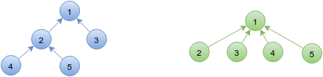
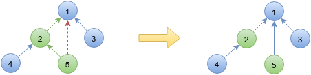
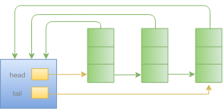

## 1、并查集简介
&emsp;&emsp;并查集，英文名为disjoint set，即**不相交集合**，用来维护一个动态不相交集的集合。为了便于理解，我们设想一个情景：有`n`个不同的元素，要分成若干不相交的集合，然后我们可以做以下两个操作：
> * 合**并**两个集合
> * 给定一个元素，**查**找包含该元素的唯一集合

&emsp;&emsp;一个查操作，一个并操作，**并查集**就是这么来的。我们将这两个操作用函数表达一下：
> * **union(x, y)**：将分别包含x，y的两个动态集合合并为一个集合，也就是对这两个集合取并集
> * **find(x)**：返回包含x的（唯一）集合的代表

&emsp;&emsp;除了这两个操作之外，《算法导论》一书第21章还提到了一般还需要我们建立一个集合[^footnote1]，定义如下：
> * **make_set(x)**：建立一个新的集合，包含唯一元素x

&emsp;&emsp;下面我们在实现并查集的时候，主要实现这三个方法，其中**union(x, y)**和**find(x)**是讨论的重点，而**make_set(x)**在许多时候是不需要专门实现的，或者说实现比较简单，在这里就忽略了。

## 2、并查集实现
&emsp;&emsp;在实现并查集的时候，我们需要先考虑两个问题：一个是集合如何表示；另一个是集合的代表如何表示。当然在比较不同实现方式的时候，需要考虑复杂度的问题，这里我们主要讨论时间复杂度，从这个角度考虑，其实现方案有两种[^footnote2]：
> * 保证`find`操作能够以常数最坏情形运行时间执行
> * 保证`union`操作能够以常数最坏情形运行时间执行

&emsp;&emsp;已经证明二者不能同时以常数最坏情形运行时间执行[^footnote2]。具体的实现方法如下所述。

### 2.1、以最小元素代表集合
&emsp;&emsp;这种方法以集合中最小的元素来标识该集合，我们在具体实现的时候用一个数组`sets]`来表示元素所属集合，`set[i]`的值表示元素`i`所属的集合（也就是所属集合中最小的那个元素值）。举个例子，假设当前有`{1, 3, 4}`，`{2, 5}`，`{6, 7, 9}`,`{8}`四个集合，那么它们表示如下：

| 1 | 2 | 3 | 4 | 5 | 6 | 7 | 8 | 9 | ... i |
|--------|--------|
| 1 | 2 | 1 | 1 | 2 | 6 | 6 | 8 | 6 | **...sets[i]**

&emsp;&emsp;这样表示好了之后，进行`find`操作就比较简单了，可以直接返回所属集合，只需`O(1)`的时间。而对于`union`操作，需要将元素`x`所属集合（假定为`Sx`）与元素`y`所属集合（假定为`Sy`）合并，我们选取`Sx`与`Sy`中较小的作为新集合的代表。所以这两个集合中，有一个是不需要改动的， 而另一个则需要将其元素所属集合进行改变，这就需要遍历所有元素，时间复杂度为`O(N)`。
&emsp;&emsp;`find`和`union`操作的代码实现如下：
``` cpp
int find_set(int x){
    return sets[x];
}

void union_set(int x, int y){
    if(x == y)
        return;
    x = find_set(x);
    y = find_set(y);
    if(x == y)
        return;
    int small = min(x, y);
    int large = max(x, y);
    for(int i = 0; i < MAXN; i++){
        if(sets[i] == large)
            sets[i] = small;
    }
}

```

&emsp;&emsp;在这里，我们是选择最小元素代表集合。其实，对于选取什么代表集合是无所谓的，只要可以保证`find(a) == find(b)`当且仅当`a`和`b`在同一集合中。
&emsp;&emsp;这个算法的`union`操作需要扫描数组，时间复杂度为`O(N)`，于是连续`N-1`次`union`操作（这也是最大值）就要花费`O(N^2)`的时间，如果`union`操作比较多，这个时间复杂度是不能接受的，所以需要继续改进。
&emsp;&emsp;下面解释一下上句话中，为什么`N-1`是最大值。对于`N`个元素组成的一组不相交集合，集合个数最多有`N`个，这时候每个集合就一个元素，而一次`union`操作就会减少一个集合，当只有一个集合的时候（也就是包含所有元素的集合），就无法进行`union`操作了，所以`union`操作最多有`N-1`次。

### 2.2、以树表示集合
&emsp;&emsp;我们用一颗有根树表示一个集合，树根就是集合的代表。我们在实现的时候，还是用一个数组`sets[]`来表示树中结点之间的关系：
> * `sets[i]=i`，代表元素`i`是当前（集合）树的根节点，代表着所属的集合
> * `sets[i]=j，ｉ!= j`，表示`i`的父节点是`j`，`i`和`j`在同一个集合中

&emsp;&emsp;在这种表示方法中，每个集合是一个树，一组集合就构成了一个森林。对于`find`操作，只要向上找到树的根节点即可，所需时间和结点的深度成正比。对于`union`操作，我们将一颗树的根指向另一颗树的根，具体实现时，对于`union(x, y)`，我们选择将`y`元素所在树的根指向`x`元素所属的树的根。
&emsp;&emsp;`find`和`union`操作的代码实现如下：
``` cpp
int find_set(int x){
    int temp = x;
    while(sets[temp] != temp)
        temp = sets[temp];
    return temp;
}

void union_set(int x, int y){
    if(x == y)
        return;
    x = find_set(x);
    y = find_set(y);
    if(x == y)
        return;
    sets[y] = x;
}
```
&emsp;&emsp;我们来具体讨论一下这种方法的时间复杂度。已经说过`find`操作所需时间和结点深度成正比，当然了，这也有前提，就是我们能够以常数时间找到表示元素的结点，而在当前这种数组表示方法下，这一点是肯定的。那么这个表示集合的树的深度可以有多大呢？假定元素个数为`N`，一开始就是`N`棵树，每棵树只有一个结点，我们对这些结点一个一个合并，将合并好的树的根节点指向将要被合并的单独的结点，这样每次合并，那棵大的树的深度就会加`１`，最后形成了一个刚好有`N`个结点的线性链的树，深度为`N-1`，这种情况我们称之为最坏情况。可以参考下图：
&emsp;&emsp;&emsp;&emsp;&emsp;&emsp;
&emsp;&emsp;所以，`find`操作最坏的运行时间为`O(N)`，那么在进行`M`次`find`操作的时候，最坏情形下的时间复杂度有可能达到`O(MN)`。`find`操作是可以再优化的，下节具体再谈。
&emsp;&emsp;对于`union`操作，如果忽略查找元素（结点）根结点的时间，那么其只需`O(1)`的时间。但是在这里，`union`和`find`是息息相关的，对于非根结点的结点的合并，其时间复杂度大约等于查找其根结点的时间。所以，如果有`M`次`find`操作和最多`N-1`次`union`操作的话，最坏的时间复杂度约为`O((M+N)N)`。这里的`union`操作也是可以优化的，因为这种合并的方式可能会出现最坏情况，使得算法运行的时间复杂度变得很高。所以我们要避免出现这种情况，具体优化请参考下一节。

### 2.3、以树表示集合的两种优化
&emsp;&emsp;上一节介绍的以树表示集合的方法是需要优化的，一方面要避免最坏情况，并且要尽量降低树的深度，以便于进行`find`和`union`操作；另一方面，要想办法尽量降低`find`操作的时间复杂度，这样整体的时间复杂度就会降低。
&emsp;&emsp;《算法导论》一书中给出了两种启发式策略：**按秩合并(union by rank)**与**路径压缩(path compression)**。下面我们具体介绍一下。

#### 2.3.1、按秩合并
&emsp;&emsp;这是对合并的优化。2.2节的合并方式是很随意的，将一棵树指向另一棵树就完成了合并，这种随意性可能会使得某棵树的深度很大。现在，我们按秩合并(union by rank)，rank的选取一般有两种：**树的大小**与**树的高度**，即**按大小合并(union by size)**和**按高度合并(union by height)**。
&emsp;&emsp;按大小合并就是将结点少的树指向结点多的树。按高度合并就是将高度小的树指向高度大的树。这两种方法都可以保证树的深度不会超过`log(N)`[^footnote2]。这个是被证明了的，而我们呢，可以这样去简单理解一下。以按照高度合并为例，假定要被合并的两棵树的高度分别为`Hx`和`Hy`，合并后的树的高度为`H`，很容易得到下面的公式：
> * `H = max(Hx, Hy)`，当`Hx != Hy`时
> * `H = Hx + 1`，当`Hx == Hy`时

&emsp;&emsp;对于`N`个元素，一开始都是单独的只有`1`个结点的树（集合），其高度均为`0`，要想得到高度为`1`的树，至少需要合并两棵高度为`0`的树，合并后结点数量至少为`2*1=2`；同理，要想得到高度为`2`的树，至少需要合并两棵高度为`1`的树，合并后结点数量至少为`2*2=4`...以此类推，如果需要得到高度为`h`的树，至少需要合并两个高度为`h-1`的树，所需结点数量至少为`2^h`。同时，很容易可以理解，高度为`h`的树至少所需结点数量是肯定要比高度为`h-1`的树至少所需结点数量高的，所以上述表述也可以反过来说：数量为`2^h`的结点，最多可以组成一个高度为`h`的树。**需要说明一下，以上理解是我自己的想法，不保证合理以及正确性！**
&emsp;&emsp;下面给出按照高度合并的实现代码，这里需要保存一下每个结点的高度，可以用数组，也可以用结构体。下面给出使用数组的实现，保存高度的数组`height[]`的初始值为`0`。
``` cpp
void union_set_height(int x, int y){
    if(x == y)
        return;
    x = find_set(x);
    y = find_set(y);
    if(x == y)
        return;
    if(height[x] < height[y]){
        sets[x] = y;
    }else{
        if(height[x] == height[y])
            height[x] += 1;
        sets[y] = x;
    }
}
```
&emsp;&emsp;这个代码比较简单，是基于原来代码的改进，如果理解了上文我自己的那段证明，这段代码也不难理解。这种方式保证了树的最大深度不会超过`log(N)`，那么`find`操作的最坏时间也就是`O(log(N))`，`union`操作和整体的时间复杂度都有了很大的改进。

#### 2.3.2、路径压缩
&emsp;&emsp;这个是对`find`操作的优化，实际上是在`find`过程中对树的结构进行了优化。我们用树表示集合，其实用不到传统树中的所谓父结点子结点的关系，我们只关心两个结点的根节点，所以，以下两种树其实表示的是一个集合`{1, 2, 3, 4, 5}`：
&emsp;&emsp;&emsp;&emsp;&emsp;&emsp;
&emsp;&emsp;我们很任意发现，上图右边的树结构更好，如果所有结点都直接指向根节点，那么`find`和`union`操作都可以以常数时间运行。此处暂停一段时间......有没有发现什么问题？！
&emsp;&emsp;问题来了，第一节中有说过*“已经证明二者不能同时以常数最坏情形运行时间执行[^footnote2]。”*二者是不是矛盾了？实际上是不矛盾的，因为右边那个树结构是理想的结构，一开始是肯定构造不出来的，或者说构造出来的时间复杂度很大，不值得。我们希望在操作的时候顺便进行某种优化，使得树的结构不断趋于理想情况，也就是结点尽量离根结点更近！这样可以加快后续的操作，以期整体操作的时间复杂度可以降低！
&emsp;&emsp;我们从`find`操作入手，将2.2节中`find(x, y)`函数的实现由循环改为递归（当然了，循环也能实现，不过我感觉代码丑），先找到根结点，然后在回溯的时候，将路径上结点的父结点都改为根结点，示意图如下：
&emsp;&emsp;&emsp;&emsp;&emsp;&emsp;
&emsp;&emsp;如上图，我们在一路向上查找到元素`5`的根节点后，回溯时候，顺便将路径上的结点(元素`2`和`5`)直接指向根结点，这样就可以加快下次查询。代码实现如下：
``` cpp
int find_set_path(int x){
    if(x != sets[x])
        sets[x] = find_set_path(sets[x]);
    return sets[x];
}
```
&emsp;&emsp;抛开丑的函数名，代码是不是很漂亮！

#### 2.3.3、启发策略对运行时间的影响
&emsp;&emsp;单独使用上述两种启发策略的某一个，都可以改善操作的运行时间，如果两个
都用效果会更好！《算法导论》上有证明，同时使用两种启发策略，对于一共`m`个并查集的操作，其最坏运行时间为`O(m*f(N))`，`f(N)`为一个增长很慢的函数，并且可以证明`f(N)<=4`[^footnote1]，具体证明大家还是看书吧，好难的样子！

### 2.4、以链表表示集合
&emsp;&emsp;《算法导论》一书中给出了一种链表表示集合的方法：每个集合有一个头元素，头元素包含两个指针`head`和`tail`，顾名思义，`head`指针指向链表的第一个元素，`tail`指针指向链表的最后一个元素；链表的每个元素也包含两个指针，一个指向头元素，另一个指向下一个元素。示意图如下所示：
&emsp;&emsp;&emsp;&emsp;&emsp;&emsp;
&emsp;&emsp;我不打算具体实现这种表示方法，感觉实现起来比较麻烦，如何找到代表某元素的结点是个问题，然后无论空间复杂度还是时间复杂度，都不是最佳选择。下面我们来分析一下这种方法的`find`和`union`操作。
&emsp;&emsp;`find`操作就比较简单了，直接就可以根据指针找到集合的头，再根据头里的`head`指针就可以找到代表该集合的第一个元素，时间复杂度是`O(1)`。对于`union`操作，假定要将链`Sx`与`Sy`合并，需要将`Sx`的尾元素指向`Sy`的第一个元素来完成两个链表的拼接，然后再将原来属于`Sy`链表的每个元素由指向`Sy`的头改为指向`Sx`的头，花费的时间和链表`Sy`的长度呈线性关系。最后再将`Sx`的`tail`指向原来`Sy`的尾元素，然后删除`Sy`的头，完成最终的合并。
&emsp;&emsp;链表表示就介绍到这里，具体的其他的内容请参考《算法导论》！

## ３、并查集的应用
&emsp;&emsp;并查集的应用有很多，比如求无向图的连通分量和最小生成树等等，题目也很多，这里就不举例了，后面会单独补充，请到博客查阅。

## ４、References
[^footnote1]:《算法导论》21 用于不相交集合的数据结构
[^footnote2]:《数据结构与算法分析》8 不相交集类