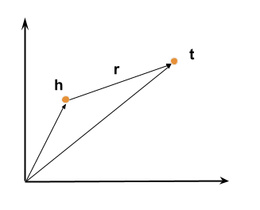

&emsp;&emsp;最近想follow一些关于Knowledge Graph Embedding（知识图谱嵌入）的工作，而TransE模型[1]应该是这个工作的代表之一。

## 一、简介
&emsp;&emsp;TransE模型的目标是学习出实体(entity)和关系(relation)的低维向量表示。对于一个三元组$(h,l,t)$（其中，$h$ 和 $t$ 是实体，$h$称为头实体，$t$称为尾实体，$l$是二者之间的关系），TransE希望他们的嵌入表示 $\mathbf{h,l,t}$ (粗体表示向量)有如下关系：$\mathbf{t}  \approx \mathbf{h}+\mathbf{l}$ ，也就是 $\mathbf{t}$ 与 $\mathbf{h} + \mathbf{l}$ 要尽可能的接近，反之，如果这三者没有关系，则要尽可能的远。用图直观表示就是：
&emsp;&emsp;&emsp;&emsp;&emsp;&emsp;&emsp;&emsp;